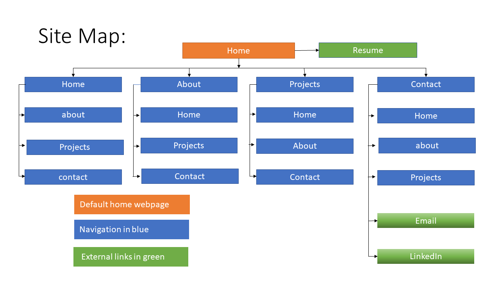

# ScottMalone_T1A2
## CCC assignment 2 

Link to published website:

**Link to code repository:**

https://github.com/ScottBurleighHeads/ScottMalone_T1A2.git (Have allowed access to the public. )

**Description:**

This is a website portfolio. This portfolio represents Scott Malone. 

**Purpose:** 

To gain employment or contract work.

**Functionality:** 

Any browser that supports HTML5.

**Features:** 

Access to pdf resume. About information, Projects, Contacts page,

**Sitemap screenshots:**

**Target audience:** 

The target audience for the portfolio website is an employer looking to engage a dev and/or IT professional. Expect the employer to have the following knowledge and expectations:

**Tech stack:** 

HTML, CSS, C, MATLAB, VHDL.

**Notes**

